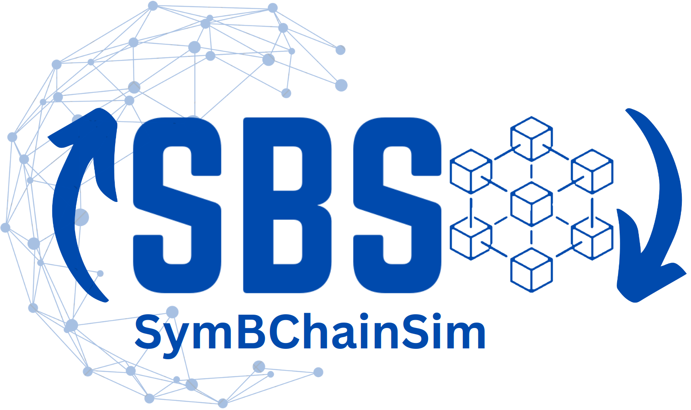

<p align="center">
  
</p>

SymBChainSim (SBS) is a discrete-event blockchain simulator written in Python, built for blockchain digital twins.
Data-driven: supports updating the simulated system (network, nodes, etc.) from data while the simulation runs.
Reconfiguration: supports changes to the blockchain's configuration (the consensus protocol, block size, etc) during runtime and models the effects.

**Documentation: https://giorgdiama.github.io/SymBChainSim/**

## Try it

You need [uv](https://docs.astral.sh/uv/getting-started/installation/). Then run:

```console
git clone https://github.com/GiorgDiama/SymBChainSim.git
cd SymBChainSim/src/Simulator
uv run Blockchain.py
```

The [Get started](https://giorgdiama.github.io/SymBChainSim/getting_started/) page explains the output.

## Cite SBS

If you use SymBChainSim, please cite:

> Diamantopoulos, G., Bahsoon, R., Tziritas, N., & Theodoropoulos, G. (2023). SymBChainSim: A novel simulation tool for dynamic and adaptive blockchain management and its trilemma tradeoff. In *Proceedings of the 2023 ACM SIGSIM Conference on Principles of Advanced Discrete Simulation* (pp. 118–127). https://doi.org/10.1145/3573900.3591121

> Diamantopoulos, G., Bahsoon, R., Tziritas, N., & Theodoropoulos, G. (2025). SymBChainSim: A novel simulation system for info-symbiotic blockchain management. *ACM Transactions on Modeling and Computer Simulation*, 35(2), 1–25. https://doi.org/10.1145/3704917
