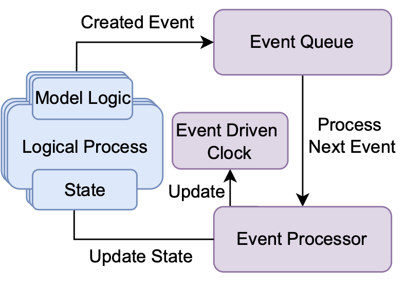

# Documentation of SymbChainSim

SymbChainSim (SBS) is a blockchain simulation tool written in Python. The main feature of SBS is its ability to support dynamic updates to both the workload and the simulated blockchain during runtime. The above makes SBS a good choice for projects focusing on the dynamic optimization of blockchain systems. Additionally, SBS aims to be modular and focuses on extensibility to allow for easy implementation of optimization environments.  

SymbChainSim takes a Discrete Event Simulation (DES) approach to simulation blockchain. A quick introduction to DES follows for anyone unfamiliar with the idea.  

## Discrete event simulation

In DES, simulated entities are modelled as Logical Processes (LP's) containing a state and logic to produce events. Each event produced by an LP is associated with a timestamp denoting when that event is supposed to take effect and is stored in an Event Queue awaiting processing. The Event Processor continuously picks the event with the earliest time stamp from the Event Queue, executes it and updates the simulation clock. The execution of an event has an effect on the state of one or more LP's which in turn produce more events and the simulation keeps progressing. The following image presents a visualization of the above.

## Walkthrough of SBS's blockchain model

The idea behind this section is to provide a walk-through of SBS source code. Specifically, the following sections describe the components of SBS with each section being associated with the Python files that model that specific component. For example, the Node section is associated with the Chain/Node.py file and it is meant to be read alongside the source code. The above is aimed to provide the basic idea behind the implementation of the blockchain components and provide intuition about using and extending SBS.

This assumes that the reader has some familiarity with the blockchain. Although an attempt is made to describe most concepts, they are never explicitly linked together to provide an overview of the inner workings of a blockchain.

## Node

Files: Chain/Node.py

SBS is built around the node model. The nodes in a blockchain system produce transactions and create blocks containing transactions to be added to the blockchain. They connect to each other over a Peer to Peer network and using a consensus protocol, communicate to build the blockchain. Each node holds a local copy of the blockchain, and the consensus protocol (when working as intended) guarantees that the blockchains of all nodes remain synchronized. Specifically, the consensus protocol acts as a voting mechanism in which nodes take turns producing blocks and voting on their validity. If consensus is reached on a block (the conditions for the above differ from protocol to protocol) this block is valid and all nodes add it to their local blockchain.

A blockchain node is modelled as a class with the following attributes:

| Attribute | Description |
|--|--|
| id | A unique id for the node |
| blockchain | a list of blocks modelling the local blockchain for this node|
| pool | a list of unconfirmed transactions to be added to the blockchain |
| neighbours | a list containing the neighbouring nodes of the node |
| location | the physical location of the node|
| bandwidth| the bandwidth of the node in MB/s|
| state | holds information about the node state (offline/online and synced/desynced)|
|cp | an instance of the current consensus protocol|
| behaviour | an instance of the behaviour modelling the behaviour of that node|
| backlog | a list of backlogged messages to be processed once the state is updated e.g., 'future' messages received by a node in a later state|
|scheduler | a class used to schedule events into the event queue|
|queue| a reference to the event queue|

### METHODS

**update**:

Checks whether the nodes have received a dynamic consensus update and if so applies it. The above is necessary since updating the state of a node immediately after receiving the update signal can result in unpredictable behaviour depending on the consensus algorithm and its current state. To circumvent the above a node can only switch protocol after the following: 1) a new block was added 2) the current consensus process failed or timed out 3) the node received a sync message with the last block using a new protocol.

**synced_with_neighbor**:

checks if is synced with all neighboring nodes and returns the neighbor with the longest chain if desynced

**kill/resurrect**:

change the state of the node to online/offline

**add_block**:

adds a block to the local blockchain

**update**:

adds event to the Event Queue

## Block

Files: Chain/Block.py

The block is the building block of the blockchain... Nodes pick uncoffined transactions from the transaction pool and from blocks which then must pass the cnossus process to be validated and added to the local blockchains of the nodes.

The block model is defined as a class with the following attributes:

|Attribute| Description|
|--|--|
|depth| the depth of the block i.e, how many blocks are in the blockchain before this block|
|id| a unique id|
|previous| a reference to the previous block|
|time_created| the time a block was created by the proposer (set by the proposer)|
|time_added| the time this block was added to the current blockchain (set individually by every node when it adds that block do its blockchain)
|miner| who created that block|
|transactions| a list of transactions included in the block|
|size| the size of the block|
|consensus| the consensus protocol used to verify the block|
|extra_data| dictionary allowing the addition of extra fields to the block|

### METHODS

**gensis_block**:

Generates the genesis block (https://en.bitcoin.it/wiki/Genesis_block - specific for Bitcoin but easily generalizable concept)

## Transaction and Transaction Factory

file: Chain/TransactionFactory.py

The model transactions of a blockchain system depend entirely on the underlying application (e.g., in Bitcoin transactions represent users exchanging currency). To maintain the generality of SBS transactions are only defined by a timestamp, a size, and their creator as these are the only properties that affect the performance of the blockchain. Due to the simplicity of the transaction model, extending its functionality to support a specific use case is relatively simple and most things could be done with minimus modification to the rest of the code base.

A transaction in SBS is defined using the following:

|Attribute| Description|
|--|--|
| Creator | the creator of the transaction |
| id | a unique id|
| timestamp| the time the transaction was created|
| size | the size of the transaction in MBs|

In a real blockchain system, the nodes are accompanied by an application instance which dictates the production of transactions. In SBS, the application layer is abstracted into the transaction factory. Instead of individual nodes producing transactions, the transaction factory produces and propagates transactions in time intervals. These transactions can either be generated randomly, read from a file, or even acquired from a real blockchain system in real time.

The transaction factory is a class with the following attributes:

|Attribute| Description|
|--|--|
| nodes | a list of the nodes in the system |
| global_mempool | provides the option to utilize a single mempool instead of each node having a unique mempool|
| depth_removed | .... |

It is worth noting that SBS offers two memory pool models 'local pools' and 'global pool'. When local pools are used, each transaction is propagated through the network to all individual nodes which store it in their local pool. The above is useful if studying the effects of transaction propagation is needed but requires more memory and slows down the execution of the simulation and transactions need to be added and removed to as many pools as the number of nodes. When a global pool is used, all the transactions go to a single pool which speeds up the simulation but prevents the modelling of 'per_node' transaction propagation delays.

The methods of transaction factory are simple and the comments in the source file should be enough to understand how they work.

## Events and Event Queue

## Scheduler and Network

### NetworkLatencies

## Event Handling

## Consensus

## Simulation

## Manager

## Metrics

## Parameters

### Configs

### scenarios
