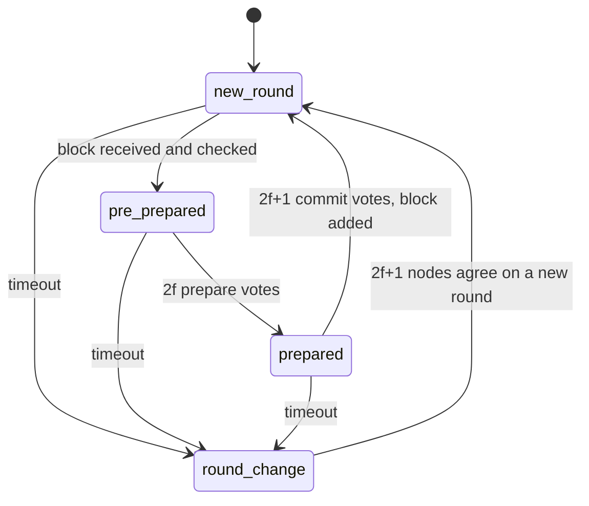

# Consensus

The consensus protocol decides how the nodes agree on the next block.
It is the heart of a blockchain, and the part that affects its performance most.

## Modelled at the message level

SBS models consensus protocols at the *message level*.
Every message that a protocol needs to agree on a block is a separate event: every proposal, every vote and every timeout.
SBS takes no shortcuts in the voting.

This makes consensus the most expensive part of a simulation, but also the most accurate.
SBS was built to help decide how to manage a real blockchain, and such decisions need an accurate picture of the protocol.

## Permissioned blockchains and vote-based protocols

There are two big families of blockchains.

In a *permissionless* (public) blockchain, such as Bitcoin, anyone can run a node.
Nobody knows who is behind a node, and one person can run thousands of nodes.
So the nodes cannot simply vote: one person with many nodes could win every vote.
These blockchains use *proof-based* protocols, such as Proof of Work.
There, the power to add a block depends on a resource, such as computing power, and not on the number of nodes.

In a *permissioned* blockchain, such as Hyperledger Fabric, only known and approved participants can run a node.
Every node has a known identity, and one participant cannot secretly add more nodes.
So every node has one vote of equal weight, and the nodes can agree by voting.
These protocols are called *vote-based* protocols.

The three protocols in SBS are vote-based protocols for permissioned blockchains.
They work in *rounds*.
In each round, one node proposes a block and the other nodes vote on it.

!!! note "What about permissionless blockchains?"
    The rest of SBS does not depend on voting.
    The engine, the nodes, the network and the transactions are generic.
    To model a permissionless blockchain, you implement its protocol, such as Proof of Work, as a new consensus protocol.
    See [Extending SBS](../guides/extending.md).

## Honest, faulty and malicious nodes

In SBS, we describe nodes in three ways:

- **Honest** nodes follow the protocol. They handle every message and reply as fast as they can.
- **Faulty** nodes are honest nodes that sometimes fail. A crash, a network problem or a software bug takes them offline for a while. While a node is offline, it does not vote.
- **Malicious** nodes break the rules on purpose. For example, they send different blocks to different nodes, or they do not vote, to harm the system.

In a real blockchain, you can never be sure that a node is honest.
Machines crash and networks fail, so faults happen all the time.
Even in a permissioned blockchain, where you know every participant, a node can be hacked, or its owner can act for their own gain.
So a protocol must reach agreement even when some nodes are faulty or malicious.

SBS models honest and faulty nodes.
You set how often nodes fail and how long they stay offline (see the [Runtime changes](../tutorials/runtime_changes.md) tutorial).

!!! note "Modelling malicious nodes"
    Faulty nodes fail in a few known ways, such as going offline.
    Malicious nodes can behave in any way, so there is no single model for them.
    SBS fully supports modelling them.
    You define how your malicious nodes behave, and you implement it in the same way as node faults.
    Node faults are system events: the Manager schedules them, and their handler changes the state of the node.
    You can find them in [`Manager/SystemEvents/BehaviourEvents.py`](https://github.com/GiorgDiama/SymBChainSim/blob/base/src/Simulator/Manager/SystemEvents/BehaviourEvents.py).

## How many votes are needed

A vote-based protocol tolerates faulty and malicious nodes, up to a limit.
For the protocol, both are the same: nodes it cannot rely on.
With `n` nodes, it tolerates `f` of them, where:

```text
f = (n - 1) / 3, rounded down
```

In other words, fewer than one third of the nodes can be faulty or malicious at the same time.

To agree on a block, a protocol needs votes from `2f + 1` nodes.
There are two reasons for this number:

- **The protocol can always get these votes.** Up to `f` nodes may never vote, so only `n - f` votes are sure to arrive. With `n = 3f + 1`, that is `2f + 1`.
- **Two decisions can never conflict.** Any two groups of `2f + 1` nodes share at least `f + 1` nodes. At most `f` of these are malicious, so at least one honest node is in both groups. An honest node never votes for two different blocks, so two different blocks can never both win.

For the default 16 nodes, `f` is 5, and a decision needs 11 votes.
If 6 nodes are offline at the same time, only 10 votes can arrive.
No block can win, and the chain stops until enough nodes come back.

Real permissioned blockchains use the same limit.
For example, Tendermint needs votes from more than two thirds of the nodes.

## A protocol is a state machine

At any moment, the protocol on each node is in one *state*.
Messages and timeouts move it from one state to the next.
Every step is an event, so every step takes simulated time.

This is PBFT, the simplest of the three:



## A round, step by step

This is one round of PBFT.

**1. Start the round.**
The node waits for the block time, the minimum time between two blocks.
It works out which node is the proposer for this round, and it starts a timeout.

**2. Propose.**
The proposer takes transactions from its pool and builds a block.
Building a block takes time: a fixed creation time plus some time for each transaction.
If the pool is empty, the proposer tries again every second, as long as the round has time left.

**3. Pre-prepare.**
The proposer sends the block to all nodes.
Each node checks the message and the block, which takes time, and then sends a *prepare* vote to all nodes.

**4. Prepare.**
When a node has `2f` prepare votes, it is *prepared*.
Together with the proposer's block, `2f + 1` nodes now agree on it.
The node sends a *commit* vote to all nodes.

**5. Commit.**
When a node has `2f + 1` commit votes, it adds the block to its chain and starts the next round.
The proposer also sends the finished block to all nodes.
A node that fell behind during the round can add this block directly.

Each vote is a message.
It passes through the [network model](network.md), and the receiver spends time to check it.
So the number of nodes, the network and the size of the messages all shape how long a round takes.

### Messages from other rounds

A node can get a message for a round it is not in.
A message for an old round is dropped.
A message for a later round goes into the node's backlog, and the node uses it when it gets to that round.

## Choosing the proposer

In each round, one node is the proposer.
A *proposer selection function* decides which node it is.
A good function has four properties:

- **Every node gets the same answer.** Each node computes the proposer on its own, from data it already has, such as the last block and the round number. The nodes do not send extra messages to agree on it.
- **It is fair.** Over time, every node proposes its share of the blocks. If nodes have different voting power, the share follows the voting power.
- **It is hard to predict far ahead.** If an attacker knows the next proposers, it can target them, for example by flooding them with traffic.
- **It moves on from failures.** If a proposer fails, the next round picks another node.

SBS has two functions, set with `execution.proposer_selection`:

- `round_robin`: the nodes take turns, in order of their ID.
- `hash`: the proposer comes from the ID of the last block plus the round number. Block IDs in SBS are random numbers, so the proposer looks random, but every node gets the same answer. This stands in for the hash of the last block, which real blockchains use.

The round number is part of the `hash` method for a reason.
If a proposer fails, no new block is added, so the last block stays the same. Without the round number, the same failed node would be picked again and again.

## When a round fails

A round can fail.
The proposer can be offline, or a vote can be lost because a node was offline.
Each round has a timeout, set in the config file of each protocol.

When the timeout expires, the node first checks two things:

1. Is a new configuration waiting? If so, it applies it (see [Reconfiguration](reconfiguration.md)).
2. Has it fallen behind the other nodes? If so, it catches up first (see [Nodes, blocks and transactions](nodes_blocks_transactions.md#catching-up-sync)).

If neither is true, the node starts a *round change*.
It sends a vote to move to the next round.

- When a node sees `f + 1` votes for a later round, it joins that round change, even if its own timeout has not expired. `f + 1` votes mean that at least one honest node wants to move on.
- When a round gets `2f + 1` votes, the node starts that round, with a new proposer.

A node also starts a round change when it gets an invalid block.

The round change logic is shared by all three protocols.

## The three protocols

All three protocols follow the same three phases in SBS.
They differ in a few important ways:

| | PBFT | Tendermint | BigFoot |
|---|---|---|---|
| Phases | pre-prepare, prepare, commit | the same three (propose, prevote and precommit in Tendermint terms) | the same three, plus a fast path |
| What a vote carries | the block | only the hash of the block | the block |
| Special behaviour | — | smaller votes travel faster | skips the commit phase when every node votes in time |

**Tendermint** votes carry only the hash of the block, not the full block.
Votes are much smaller, so they spend less time on the network.

**BigFoot** adds a *fast path* to PBFT.
If a node gets a prepare vote from **every** other node, it adds the block straight away and skips the commit phase.
The fast path has its own, shorter timeout (`fast_path_timeout`), which starts with the round.
If the timeout expires first, BigFoot goes on like PBFT: `2f` prepare votes, then `2f + 1` commit votes.
This is why BigFoot is fast when all nodes are online, and slow when nodes fail.
You saw both cases in the [tutorials](../tutorials/runtime_changes.md).

## How a protocol plugs into SBS

A protocol is a self-contained module.
The node knows nothing about it, apart from a small common interface.
Each protocol is a folder with the same parts:

| Part | What it does |
|---|---|
| State | The protocol's data on one node: its state, round and votes. It also starts a round and picks the proposer. |
| Transitions | What the node does when it gets each type of message. |
| Messages | How the node builds and sends each type of message. |
| Timeouts | What happens when a timeout expires. |
| Config file | The protocol's own settings, such as its timeout. |

Every event of a protocol is tagged with the protocol's name.
When a node switches to another protocol, the events of the old one are dropped.

To add your own protocol, see [Extending SBS](../guides/extending.md).

## Where it lives

- The protocols: [`Chain/Consensus`](https://github.com/GiorgDiama/SymBChainSim/tree/base/src/Simulator/Chain/Consensus), one folder each
- The common interface: [`Chain/Consensus/ConsensusProtocol.py`](https://github.com/GiorgDiama/SymBChainSim/blob/base/src/Simulator/Chain/Consensus/ConsensusProtocol.py)
- The round change: [`Chain/Consensus/Rounds.py`](https://github.com/GiorgDiama/SymBChainSim/blob/base/src/Simulator/Chain/Consensus/Rounds.py)
- The settings of each protocol: the `*_config.yaml` file in its folder
