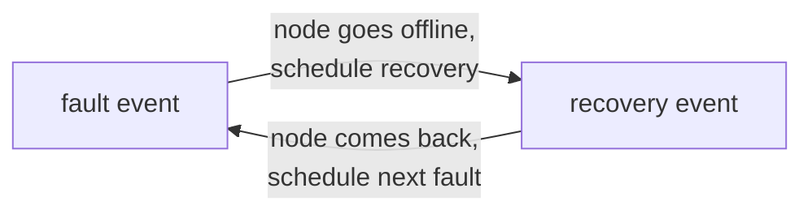

# The Manager

The Manager builds the simulation, runs it, and changes it while it runs.
The nodes model the blockchain.
The Manager models everything around it: the users who send transactions, the network that changes, the machines that fail, and the changes in configuration.

## Setting up a run

Before the first event, the Manager:

1. Loads the config file and applies your `--set` overrides.
2. Creates the nodes and the network.
3. Schedules the first system events, such as the first batch of transactions.
4. Loads the workload trace, if you gave one in `application.workload`.

A scenario run is set up in a different way.
The scenario file holds all the changes for the whole run, so the Manager schedules all of their events at the start (see the [Scenarios](../tutorials/scenarios.md) tutorial).

Then the Manager runs the main loop, which is described on the [Simulation engine](simulation_engine.md) page.

## System events

The Manager changes the simulation through *system events*.
A system event is an event like any other: it has a time, and it waits in the event queue.
But it belongs to no node.
When its time comes, the Manager handles it, and the Manager picks the handler from the type of the event.

Each system event has two functions:

- A `schedule_*` function creates the event and puts it in the queue.
- A `handle_*` function makes the change when the event happens.

Most handlers also schedule the next event of the same type.
So one event is enough to start a chain that lasts for the whole run.

This is the chain for a faulty node:

The time until the next fault and the time until recovery are random.
Each faulty node has its own average times, set in [`behaviour_config.yaml`](https://github.com/GiorgDiama/SymBChainSim/blob/base/src/Configs/behaviour_config.yaml).

!!! note "Malicious nodes"
    SBS has no default models for malicious nodes. You can model any malicious behavior you need using system events.
    See [Modelling malicious nodes](consensus.md#honest-faulty-and-malicious-nodes).

## The system events in SBS

| Events | What they do | How to turn them on |
|---|---|---|
| Transaction generation | Create the transactions for the next interval, every `application.tx_interval` seconds | On by default. Off when you use a workload trace. |
| Dynamic network and workload | Change the bandwidth, the transaction rate and the transaction size, at the same interval as the transactions | `dynamic_sim.use` |
| Faults and recoveries | Take faulty nodes offline and bring them back | `behaviour.use` |
| Scenario events | Apply the transactions, bandwidths and faults from a scenario file | `--scenario` |
| Reconfiguration | Create a new configuration and send it to the nodes | `--reconfig` |
| Snapshots | Save the state of the simulation every `simulation.snapshot_interval` seconds | On by default. Set the interval to `-1` to turn them off. |

The [Runtime changes](../tutorials/runtime_changes.md) tutorial shows the dynamic, fault and reconfiguration events in a real run.
Reconfiguration needs more than one event, because the nodes must agree on the new configuration. See [Reconfiguration](reconfiguration.md).

## Simulation updates

Some tasks do not need an exact time.
The Manager runs these *simulation updates* after every event:

- Print the progress every `simulation.print_every` seconds.
- Start the debugger at `simulation.start_debugging_at`.

Simulation updates are not events.
They run after the first event that passes their time, so they can run a little late.
If a change must happen at an exact time, use a system event.

## Connecting SBS to a real system

SBS was built to work next to a real blockchain, as part of a digital twin.
In this setting, the simulation must follow what happens in the real system.

The Manager is the link between the two.
Any change in the real system can become a system event: a node that goes offline, a drop in bandwidth, or a new workload.
SBS does not include a connection to a real blockchain.
To build one, you write system events that bring in data from the real system.

!!! Note
    This requires a method to convert physical time to simulated  time.

## Adding your own system event

1. Write a `schedule_*` and a `handle_*` function in a new file in `Manager/SystemEvents`. The schedule function creates a `SystemEvent` with a new `type` in its payload.
2. Add a case for your `type` to `Manager.handle_system_event`.
3. Schedule the first event in `Manager.init_system_events`, usually behind a config switch.

See [Extending SBS](../how_to/extending.md) for more.

## Where it lives

- The Manager: [`Manager/Manager.py`](https://github.com/GiorgDiama/SymBChainSim/blob/base/src/Simulator/Manager/Manager.py)
- The system events: [`Manager/SystemEvents`](https://github.com/GiorgDiama/SymBChainSim/tree/base/src/Simulator/Manager/SystemEvents), one file for each kind
- Scenario and workload set-up: [`Manager/ScenariosAndWorkloads.py`](https://github.com/GiorgDiama/SymBChainSim/blob/base/src/Simulator/Manager/ScenariosAndWorkloads.py)
- Simulation updates: [`Manager/SimulationUpdates.py`](https://github.com/GiorgDiama/SymBChainSim/blob/base/src/Simulator/Manager/SimulationUpdates.py)
