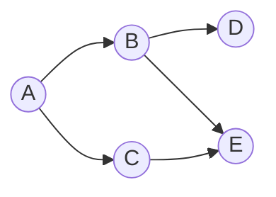

# The network

The network model decides when a message arrives.
Every vote, every block, every transaction and every sync passes through it.
So the network shapes much of the latency and block time you measure.

## The delay of a message

When a node sends a message, SBS calculates how long it takes to arrive:

```text
delay = transmission + latency + queueing + processing
```

- **Transmission** is the time to push the bytes onto the link: the message size divided by the bandwidth.
    - The bandwidth is the lower of the sender's and the receiver's bandwidth. A message is only as fast as the slower side.
    - The size is a base size (headers, signatures) plus the content. A message that carries a block also carries the full block size, so big blocks travel slowly.
- **Latency** is the time the signal needs to cross the distance between the two nodes. It depends on where the nodes are (see below).
- **Queueing** and **processing** are fixed extra times, added to every message.

The message then becomes an event at the receiver, at the send time plus the delay.

## Where the nodes are

At the start of a run, each node gets a random city from a list of 62 cities around the world.
The latency between two nodes depends on their cities.
You choose how SBS calculates it with `network.use_latency`:

| Model | Latency between two nodes |
|---|---|
| `measured` | Taken from a dataset of measured latencies between the cities. |
| `distance` | Calculated from the distance between the cities, with a formula fitted to real measurements. |
| `local` | The same-city latency for every pair of nodes, as if all nodes were in one city. |
| `off` | Zero. Only the transmission, queueing and processing delays count. |

With `measured`, two nodes in the same city use the same-city latency, `network.same_city_latency_ms`.
The datasets are in [`src/Resources/NetworkLatencies`](https://github.com/GiorgDiama/SymBChainSim/tree/base/src/Resources/NetworkLatencies).

## Bandwidth

Each node has a bandwidth in MB/s.
It is drawn from a normal distribution with a mean and a deviation, and it never goes below a minimum.
One value is used for both upload and download.

`network.bandwidth.sample` decides how often SBS draws it:

- `always`: a new value for every message. This models a connection whose speed goes up and down.
- `once`: one value per node at the start. Each node keeps a fixed speed.
- `scenario`: the scenario sets the bandwidth of each node, and SBS draws nothing.

The dynamic simulation changes the mean and the deviation during the run (see the [Runtime changes](../tutorials/runtime_changes.md) tutorial).

## How messages spread

SBS has two ways to send a message to all nodes.
You choose with `network.gossip`.

**Broadcast** (`gossip: False`).
The sender sends a copy straight to every other node.
Each copy has its own delay.

**Gossip** (`gossip: True`, the default).
Each node has a few neighbours, picked at random (`network.num_neighbours`).
The sender sends the message to its neighbours.
A node that gets a new message handles it once and forwards it to its own neighbours.
The message spreads in hops until all nodes have it.



With gossip, a message reaches far nodes after several hops, so it arrives later than with broadcast.
In return, each node sends only a few messages instead of one to every node.
This is how most real blockchain networks work.

SBS takes one shortcut here.
A node does not forward a message to a neighbour that already has it.
A real node would not know this, but the extra copy would be dropped anyway.
Skipping it saves many events and does not change when messages arrive.

## What the model leaves out

- **Congestion.** SBS calculates each message on its own. A node that sends many messages at once does not slow down, and links are never full. The queueing delay is a fixed value.
- **Separate upload and download speeds.** A node has one bandwidth for both.

## Where it lives

The network model is in [`Chain/Network.py`](https://github.com/GiorgDiama/SymBChainSim/blob/base/src/Simulator/Chain/Network.py).
You set it in the `network` group of [`src/Configs/base.yaml`](https://github.com/GiorgDiama/SymBChainSim/blob/base/src/Configs/base.yaml).
