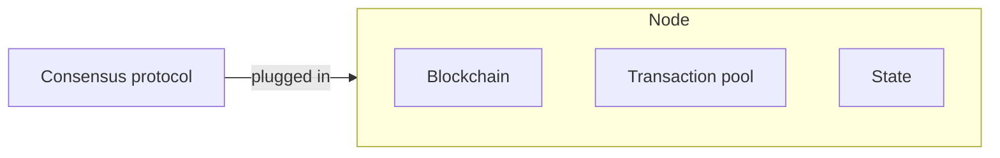

# Nodes, blocks and transactions

This page explains the basic parts of the simulated blockchain: the nodes, the blocks they add and the transactions inside the blocks.

## Nodes

A node in SBS is a generic blockchain node.
It holds:

- its own copy of the blockchain,
- a pool of transactions that wait for a block,
- its neighbours in the network,
- its state: online or offline, in sync or behind.

A node has no consensus logic of its own.
The consensus protocol is a separate part that is plugged into the node.

This is a key design choice of SBS.
To switch protocols during a run, SBS only swaps the protocol.
The blockchain and the transactions of the node stay as they are.

SBS only models the nodes that take part in consensus.
The users that send transactions are modelled by the transaction factory, below.

## Blocks

A block is a simple container.
It holds its height in the chain, the node that made it, the time it was created and added, its transactions and its size.

A block also has a free field for extra data.
Each protocol uses it for its own information, such as the round the block was made in.

The size of a block is a base size plus the size of its transactions.
It cannot be bigger than the maximum block size.
You set both in the `data` group of [`src/Configs/base.yaml`](https://github.com/GiorgDiama/SymBChainSim/blob/base/src/Configs/base.yaml).

## Transactions

In a real blockchain, users send transactions to the nodes.
In SBS, one *transaction factory* plays the role of all users.

Every few seconds, the factory creates the transactions for the next interval.
For each transaction, it picks a random node as the creator and a random size.
You set the rate and the sizes in the `application` group of [`src/Configs/base.yaml`](https://github.com/GiorgDiama/SymBChainSim/blob/base/src/Configs/base.yaml).
The transactions can also come from a scenario or a workload trace.

A new transaction takes some time to reach the nodes.
SBS adds a network delay before a transaction enters a pool.

### Two pool models

SBS has two ways to model the transaction pool:

- **Local pool.** Each node has its own pool. Each copy of a transaction arrives at each node with its own network delay. This is closer to a real blockchain but is slower to simulate and uses more memory.
- **Global pool.** All nodes share one pool. SBS keeps one copy of each transaction, with one delay based on the network of its creator. This is much faster but increases the abstraction of the simulation. The TOMACS paper contains detailed analysis comparing the two models.

The global pool is the default.
You choose the model with `application.transaction_model`.

### Choosing transactions for a block

A node that makes a block takes the oldest transactions first.
It only takes transactions that have already arrived, and it stops when the block is full or the pool is empty.
A transaction stays in the pool until it is added to a block and that block is committed.

## Catching up: sync

A node can fall behind the others, for example after it was offline.
It notices this when it gets a block from further ahead, or when it times out and sees that a neighbour has a longer chain.

A real node would ask its peers for the missing blocks, one message at a time.
SBS does not model each of these messages.
Instead, it calculates how long the transfer would take: the network delay, the validation time and a request delay for each missing block.
It then adds all the missing blocks at once, at that time.
This keeps the timing realistic and makes the simulation faster.

While a node catches up, it does not take part in consensus.
When it has all the blocks, it rejoins the consensus protocol.

## Where it lives

- Nodes: [`Chain/Node.py`](https://github.com/GiorgDiama/SymBChainSim/blob/base/src/Simulator/Chain/Node.py)
- Blocks: [`Chain/Block.py`](https://github.com/GiorgDiama/SymBChainSim/blob/base/src/Simulator/Chain/Block.py)
- Transactions and pools: [`Chain/TransactionFactory.py`](https://github.com/GiorgDiama/SymBChainSim/blob/base/src/Simulator/Chain/TransactionFactory.py)
- Sync: [`Chain/Consensus/HighLevelSync.py`](https://github.com/GiorgDiama/SymBChainSim/blob/base/src/Simulator/Chain/Consensus/HighLevelSync.py)
