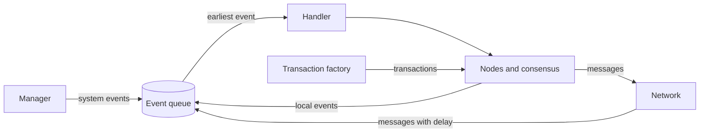

# Overview

This page is a map of SBS.
Each part has its own page in this section.

## Three groups of parts

SBS has three groups of parts:

- **The simulation engine** runs the simulation. It keeps the clock and executes events in time order.
- **The blockchain models** describe the blockchain: nodes, blocks, transactions, the network and the consensus protocol.
- **The Manager** sets up the simulation and changes it while it runs, for example when a node fails or the workload changes.

The Manager and the nodes put events into the queue.
The engine takes the earliest event and hands it to the right model.
Handling an event creates new events, and the loop goes on.

## The layers of a blockchain

SBS splits a blockchain into five layers.
Each layer is modelled on its own, so you can change or replace one layer without touching the others.

| Layer | What it models | Settings |
|---|---|---|
| Application | The users: how many transactions they send, and how big they are. | `application` |
| Execution | The time a node spends on work, such as creating a block or validating a message. | `execution` |
| Data | The blocks: their maximum size and the minimum time between two blocks. | `data` |
| Consensus | How the nodes agree on the next block. | `consensus` and one file per protocol |
| Network | How messages travel between nodes, and how long they take. | `network` |

The settings column is the group name in [`src/Configs/base.yaml`](https://github.com/GiorgDiama/SymBChainSim/blob/base/src/Configs/base.yaml).
