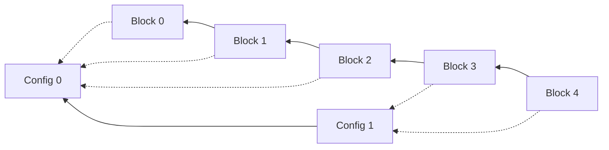

# Reconfiguration

The best configuration for a blockchain depends on its conditions.
For example, BigFoot is faster than PBFT when all nodes are online, but slower when nodes fail (see [The three protocols](consensus.md#the-three-protocols)).
And the conditions change all the time: the workload, the network and the number of nodes that are online.
So a fixed configuration will have periods where another configuration would work better.

Thus a blockchain can do better if it changes its configuration while it runs.
We call this *reconfiguration*.
SBS currently models changes to three parameters: the consensus protocol, the maximum block size and the block time.
The mechanism can change any parameter.
You put the new value in the configuration block, and you add the logic that applies it on the nodes.

However, a blockchain cannot switch configurations in an instant.
The nodes must learn about the new configuration and switch at a safe time.
We have proposed a mechanism that does this, and SBS models it.

Reconfiguration has two parts:

- **The configuration update mechanism** runs on the nodes. It spreads a new configuration and applies it. The nodes get the new configuration at different times, and a switch in the middle of a round can break consensus. Old blocks must also stay easy to check after the configuration changes.
- **The decision-making mechanism** decides which configuration to use, and when. It needs an accurate view of the whole system. Most of all, it must not put a single party in control, because a blockchain must stay decentralised.

## The configuration update mechanism

SBS uses a mechanism we proposed in our paper on decentralised blockchain management.

### The configuration chain

Each node keeps a second blockchain, the *configuration chain*.
Its blocks hold configurations instead of transactions.
The latest configuration block sets the configuration of the node.

The first configuration block holds the configuration from [`base.yaml`](https://github.com/GiorgDiama/SymBChainSim/blob/base/src/Configs/base.yaml).
Every run has a configuration chain.
Without reconfiguration, it never gets a second block.

Each data block records the latest configuration block that its proposer has.
So the two chains are linked:



A blockchain is a chain of blocks that anyone can check.
The configuration chain keeps this property.
To check an old block, you look up the configuration it was made under.

### Spreading and applying a new configuration

A new configuration spreads over gossip, so it reaches some nodes sooner than others.
When a node receives a new configuration block, it:

1. Drops the block if it already has it.
2. Sends the block to its neighbours (gossip).
3. Adds the block to its configuration chain.

If there is a gap, the node has missed a configuration block.
It catches up first, in the same way as it does for data blocks (see [Catching up](nodes_blocks_transactions.md#catching-up-sync)).
Soon, every node has the new block.

Nodes do not switch as soon as they get a new configuration block.
Switching in the middle of a round would break the round, and the round would fail on many nodes.

So the node switches only between rounds.
It checks for a new configuration at two points:

- When a new round starts.
- When a round times out (see [When a round fails](consensus.md#when-a-round-fails)).

A new block size or block time takes effect at once.
A new protocol replaces the old one: the node starts the new protocol from the next round.

!!! note "Adding new reconfiguration options"
    When you add a new parameter to reconfigure, think about when it is safe to change it.
    Then add logic that applies the change at that time.

Nodes do not switch at the same time.
Each node switches at its next safe point.
For a short time, some nodes run the old configuration and some run the new one.
A protocol needs enough nodes on the new configuration to reach consensus.
Until enough nodes have switched, the old configuration is used.

### Checking blocks

When a node checks a new data block, it also checks the configuration block the data block records:

- If it is older than the node's latest configuration block, the data block is invalid.
- If it is newer, the node has missed a configuration block. It catches up on the configuration chain first.

So nodes only accept blocks made under the latest configuration.
This ensures that all honest nodes will adopt the new configuration in the end.

## The decision-making mechanism

The decision-making mechanism decides the next configuration and creates the configuration block.

### The centralised method

SBS includes a simple centralised method.
The Manager creates the configuration blocks with a [system event](manager.md#system-events).

Every `reconfiguration_interval` seconds (plus a random shift from `reconfiguration_interval_range`), the Manager:

1. Picks a random protocol, block size and block time from `random_configuration`.
2. Creates a configuration block with them.
3. Sends the block to a share of the nodes (`propagation.per_cent_nodes`), after a small random delay (`propagation.delay`).

Gossip takes the block to the other nodes.
If you set `propagation.model` to `False`, all nodes get the block at once, and there is no gossip.

These settings are in the `reconfiguration` group of [`base.yaml`](https://github.com/GiorgDiama/SymBChainSim/blob/base/src/Configs/base.yaml).
To turn it on, use `--reconfig`:

```bash
uv run python Blockchain.py --reconfig --seed 7 --set simulation.sim_time=700
```

```text
SymBChainSim | PBFT | 16 nodes | 700 s | seed 7
0 / 700 s                 0 blocks           0 tx
100 / 700 s              83 blocks      11,880 tx
200 / 700 s             165 blocks      23,760 tx
300 / 700 s             249 blocks      35,880 tx
    [RECONFIG]   311.9 s  switched to   PBFT, max block size 4 MB, block time 0.5 s
400 / 700 s             305 blocks      47,760 tx
500 / 700 s             360 blocks      59,760 tx
600 / 700 s             416 blocks      71,880 tx
    [RECONFIG]   614.4 s  switched to   Tendermint, max block size 4 MB, block time 0.5 s
700 / 700 s             497 blocks      83,880 tx
 RESULTS (mean over 16 nodes)
  Blocks                   497  (PBFT 424, Tendermint 73)
```

Each `[RECONFIG]` line shows the time the Manager created a configuration block.
The nodes switch a little later, at their next safe point.
The results show how many blocks each protocol produced.

The method picks configurations at random.
To make better choices, replace the random choice with your own optimiser, such as a heuristic or a reinforcement learning agent.
The mechanism stays the same.

### The decentralised method (coming soon)

In the centralised method, one party decides the configuration for everyone.
This goes against the idea of a blockchain, where no single party is in control.

Our paper proposes a decentralised method.
It adds *management nodes*, which represent the stakeholders of the system.
The management nodes run their own blockchain.
In it, they propose configuration blocks and agree on them by consensus.
You can think of it as a normal blockchain whose application is making reconfiguration decisions. This system mirrors the decentralization requirements of the underlying blockchain that is reconfigured. 

To decide, each management node needs an accurate view of the blockchain and a way to make local decisions.
One such method is our Blockchain Digital Twin, but any decision method works.

The blockchain nodes follow the configuration chain as observers.
Each time a new configuration block is added, they reconfigure with the mechanism described above.

!!! note
    This method is not in the public version of SBS yet, but it will be added soon.

> Diamantopoulos, G., Tziritas, N., Bahsoon, R. and Theodoropoulos, G. "Decentralised Blockchain Management Through Digital Twins." *Asia Simulation Conference*. Singapore: Springer Nature Singapore, 2025.

## Where it lives

- The mechanism on the nodes: [`Chain/Reconfiguration/ReconfigurationState.py`](https://github.com/GiorgDiama/SymBChainSim/blob/base/src/Simulator/Chain/Reconfiguration/ReconfigurationState.py)
- The configuration block: [`Chain/Reconfiguration/ConfigurationBlock.py`](https://github.com/GiorgDiama/SymBChainSim/blob/base/src/Simulator/Chain/Reconfiguration/ConfigurationBlock.py)
- The centralised method: [`Chain/Reconfiguration/CentralisedReconfiguration.py`](https://github.com/GiorgDiama/SymBChainSim/blob/base/src/Simulator/Chain/Reconfiguration/CentralisedReconfiguration.py) and [`Manager/SystemEvents/ReconfigurationEvents.py`](https://github.com/GiorgDiama/SymBChainSim/blob/base/src/Simulator/Manager/SystemEvents/ReconfigurationEvents.py)
- Catching up on the configuration chain: [`Chain/Consensus/HighLevelSync.py`](https://github.com/GiorgDiama/SymBChainSim/blob/base/src/Simulator/Chain/Consensus/HighLevelSync.py)
