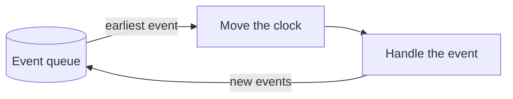

# The simulation engine

The engine runs the simulation.
It knows nothing about blockchains. It only knows how to execute events in the right order.

## Discrete-event simulation in 2 minutes

SBS is a *discrete-event simulation* (DES).
A DES models a system as a series of events.
An event is something that happens at a point in time: a node sends a vote, a timeout expires, a node fails.

The events wait in a queue, sorted by time.
The engine repeats three steps:

1. Take the earliest event from the queue.
2. Move the clock to the time of that event.
3. Handle the event.

Handling an event changes the state of the system, and usually creates new events.
For example, when a node proposes a block, it sends a message to every other node.
Each message becomes an event that arrives a little later.

Nothing happens between two events, so the clock jumps from one event to the next.
This is why SBS can simulate 30 minutes of a blockchain in less than a minute.

## Three kinds of events

- **Local events** are events a node schedules for itself, such as a timeout. They never leave the node.
- **Message events** go from one node to another. They pass through the network model, which decides when they arrive.
- **System events** come from the Manager. They create transactions, change the network or the workload, make nodes fail, and take snapshots.

## Who handles an event

Each event carries its own handler.
The part of SBS that creates an event also knows how to handle it.
For example, the consensus protocol creates vote events, so it must also know how to handle them.

The engine only picks the next event and calls its handler.
So you can add a new model without changing the engine.

Before the event handler is called, a generic handler checks a few things.
It drops the event if the node is offline.
It also drops the event if it belongs to a protocol the node no longer runs, for example after a switch to another protocol.
It does a few more things, such as forwarding gossip messages. You can explore its logic in [`Engine/Handler.py`](https://github.com/GiorgDiama/SymBChainSim/blob/base/src/Simulator/Engine/Handler.py).

## Messages that arrive too early

In a real network, messages can arrive out of order.
A node can get a vote for the next round before it has finished the current round.

When a handler cannot use a message yet, the node keeps it in its *backlog*.
When the node moves to a new state, it tries the messages in its backlog again.

## When the run stops

After each event, SBS checks if the run is over.
A run stops after a set simulated time, a set number of blocks or a set number of transactions.
You choose the limit in the `simulation` group of [`src/Configs/base.yaml`](https://github.com/GiorgDiama/SymBChainSim/blob/base/src/Configs/base.yaml).

## Where it lives

The engine is in [`src/Simulator/Engine`](https://github.com/GiorgDiama/SymBChainSim/tree/base/src/Simulator/Engine).
The main loop is `Manager.run` in [`src/Simulator/Manager/Manager.py`](https://github.com/GiorgDiama/SymBChainSim/blob/base/src/Simulator/Manager/Manager.py).
