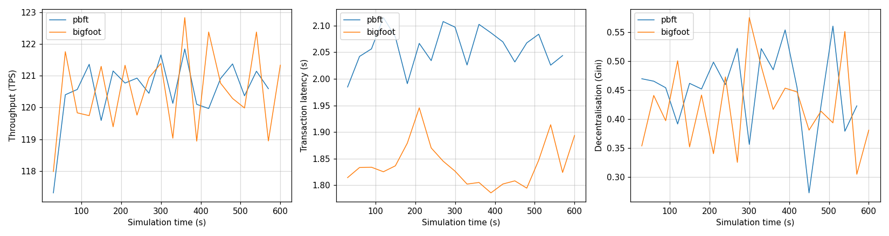

# Compare two runs

In this tutorial you run PBFT and BigFoot on the same blockchain and plot their results side by side.

## PBFT and BigFoot

Both protocols agree on each block through rounds of votes.
In PBFT, the nodes vote twice for every block: first a *prepare* vote, then a *commit* vote.
BigFoot has a shortcut, called the *fast path*.
If **every** node sends its prepare vote, the block is added right away, without the commit votes.
When all nodes are online and the network is fast, BigFoot should make blocks faster than PBFT.

## 1. Run PBFT

```console
uv run Blockchain.py --set simulation.sim_time=600 --name pbft
```

`--name` sets the name of the snapshot file.
This run saves its snapshots to `Outputs/Snapshots/pbft.json`.
Without `--name`, every run writes to `snapshot.json` and replaces the previous one.

## 2. Run BigFoot

```console
uv run Blockchain.py --set simulation.sim_time=600 --cp BigFoot --name bigfoot
```

Both runs use the same settings and the same seed.
Only the consensus protocol is different.

## 3. Compare the results

The RESULTS of the two runs:

| | PBFT | BigFoot |
|---|---|---|
| Blocks | 394 | 461 |
| Throughput | 119.9 tx/s | 119.9 tx/s |
| Mean latency | 2.06 s | 1.84 s |
| Mean block time | 1.52 s | 1.30 s |
| Mean block size | 0.44 MB | 0.38 MB |

Both protocols confirm all 120 transactions per second, so the throughput is the same.
BigFoot makes blocks more often, because the fast path skips the commit votes.
Its blocks are smaller, and transactions wait less time for a block.

## 4. Plot the runs over time

SBS takes a *snapshot* every 30 simulated seconds.
A snapshot holds the results for the blocks added since the previous snapshot.

Open the plotting notebook:

```console
cd ../ScenarioGenerationAndVisualisation
uv run jupyter lab snapshot_visualisation.ipynb
```

You can also open the notebook in your editor, for example VS Code.

In the second cell, list the two snapshot files:

```python
names = ["pbft.json", "bigfoot.json"]
```

Then run all cells. You get three plots:



Each point is one snapshot, so it shows the results of one 30-second window.

- **Throughput** stays close to 120 tx/s for both protocols.
- **Latency** is lower for BigFoot during the whole run.
- **Decentralisation** jumps up and down. A 30-second window holds only 20 to 25 blocks, so by chance some nodes make more blocks than others. Over the whole run, the Gini is much lower (0.12 for PBFT and 0.09 for BigFoot).

## Your turn: push the protocols harder

At 120 transactions per second, both protocols keep up.
Send more transactions and find the point where BigFoot takes a clear lead over PBFT.

Change the number of transactions per second with `application.tx_per_sec`.
Run the simulations from `src/Simulator`, as before:

```console
uv run Blockchain.py --set simulation.sim_time=600 --set application.tx_per_sec=140 --name pbft_140
```

Run both protocols at each rate, and give every run its own name.
Watch the throughput, the mean latency and the number of pending transactions.
A protocol is overloaded when it can no longer confirm all the transactions it receives.
Add the runs to `names` to see how the latency changes over time.

!!! tip
    SBS visualizes runs by periodically taking 'snapshots' of the simulated blockchain state. The frequency of these snapshots thus has an effect on the visualization. To change how often SBS takes a snapshot, use `simulation.snapshot_interval`.

So far, all nodes stay online.
In the next tutorial, some nodes fail during the run, and BigFoot's fast path stops working.
