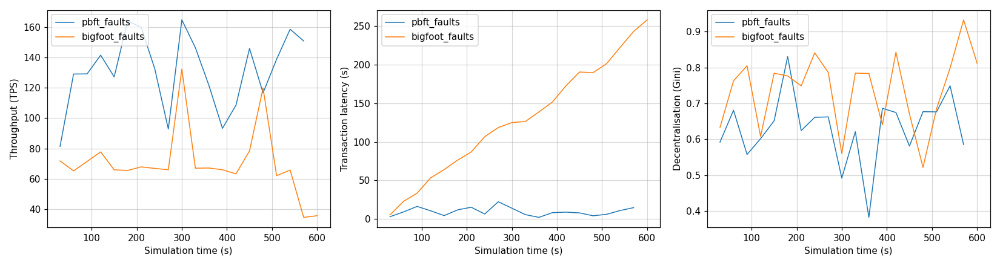

# Runtime changes

In the first tutorial, all nodes stayed online and the workload never changed.
Real blockchains are not like this.
Nodes fail and recover, and the workload and the network change over time.

SBS can model these changes while the simulation runs.
In this tutorial you turn on each type of change and see its effect.

## 1. Nodes that fail

Turn on faulty nodes with `behaviour.use`, and run PBFT and BigFoot again:

```console
uv run Blockchain.py --set simulation.sim_time=600 --set behaviour.use=true --name pbft_faults
uv run Blockchain.py --set simulation.sim_time=600 --set behaviour.use=true --cp BigFoot --name bigfoot_faults
```

The output now shows when nodes fail and recover:

```text
0 / 600 s                 0 blocks           0 tx
    [FAULT]        4.5 s  node 0 failed
    [FAULT]        9.0 s  node 2 failed
    [FAULT]       12.8 s  node 0 recovered
    [FAULT]       19.5 s  node 4 failed
    [FAULT]       32.9 s  node 0 failed
    [FAULT]       75.7 s  node 2 recovered
100 / 600 s              10 blocks       9,842 tx
```

!!! note
    The progress lines count the blocks that **all** nodes have.
    An offline node misses new blocks, so this count grows slowly while a node is offline.
    The RESULTS show the mean over all nodes.

The results of the two runs:

| | PBFT | BigFoot |
|---|---|---|
| Blocks | 205 | 98 |
| Throughput | 119.8 tx/s | 67.1 tx/s |
| Mean latency | 9.47 s | 120.54 s |
| Pending transactions | 2,640 | 32,264 |

In the first tutorial BigFoot was faster. Now it falls far behind.
Its fast path needs a vote from every node.
When a node is offline, the vote never arrives.
BigFoot waits for a timeout (5 s) and then continues on the slower path.
With frequent faults, this happens in almost every round.
PBFT only needs votes from two thirds of the nodes, so a few offline nodes slow it down much less.

Plot the two runs with `names = ["pbft_faults.json", "bigfoot_faults.json"]`:



BigFoot cannot keep up, so transactions pile up and its latency keeps growing.

You set the number of faulty nodes and how often they fail in [`src/Configs/behaviour_config.yaml`](https://github.com/GiorgDiama/SymBChainSim/blob/base/src/Configs/behaviour_config.yaml).

## 2. A changing workload and network

Turn on the dynamic simulation with `dynamic_sim.use`:

```console
uv run Blockchain.py --set simulation.sim_time=600 --set dynamic_sim.use=true
```

Every 10 seconds, SBS picks a new workload and new network conditions:

```text
    [DYNAMIC]      0.0 s  workload      69 tx/s, mean tx size 15.1 KB
    [DYNAMIC]      0.0 s  network       bandwidth 8.9 ± 2.6 MB/s
    [DYNAMIC]     10.0 s  workload      63 tx/s, mean tx size 10.0 KB
    [DYNAMIC]     10.0 s  network       bandwidth 11.9 ± 2.7 MB/s
```

You set what changes and the ranges of the new values in [`src/Configs/dynamic_config.yaml`](https://github.com/GiorgDiama/SymBChainSim/blob/base/src/Configs/dynamic_config.yaml).
You set how often they change with `application.tx_interval` in [`src/Configs/base.yaml`](https://github.com/GiorgDiama/SymBChainSim/blob/base/src/Configs/base.yaml).

In a digital twin setting, these updates would come from data measured on the real blockchain.

## Combine them

You can turn on both changes in the same run:

```console
uv run Blockchain.py --set simulation.sim_time=600 --set behaviour.use=true --set dynamic_sim.use=true
```
