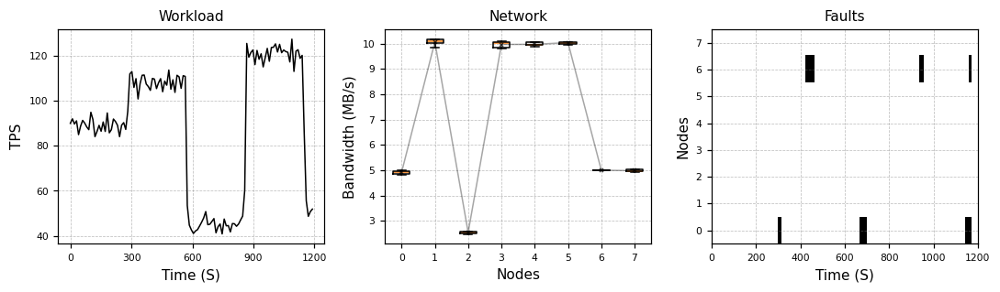
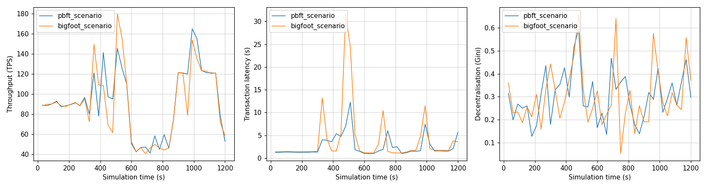

# Generate and use scenarios

In this tutorial you generate a scenario, look at it and run it with two protocols.

## What a scenario is

A scenario is a script of the conditions during a run.
It sets, over time:

- the workload: when transactions are created and how big they are,
- the network: the bandwidth of each node,
- the faults: when each node fails and for how long.

In the previous tutorial, SBS drew these changes at random during the run.
Each protocol saw different faults.
A scenario fixes them in a file, so every run sees exactly the same conditions.

A scenario can also come from real data, for example a trace from a real blockchain.

## 1. Generate a scenario

The generator lives in `src/ScenarioGenerationAndVisualisation`:

```console
cd ../ScenarioGenerationAndVisualisation
uv run generate_scenario.py --name my_scenario
```

This saves the scenario to `src/Resources/Scenarios/my_scenario.json`.
With the default settings, you get a 1200-second scenario for 8 nodes.
It is the same as `light_scenario`, the example scenario that comes with SBS.

!!! tip "Skip the generation"
    You can also use `light_scenario` for the rest of this tutorial.
    Replace `my_scenario` with `light_scenario` in each step.

The generator works like this:

1. It splits the scenario into intervals.
2. It gives each node a network type: fast, medium or slow. In each interval, the bandwidth of a node is drawn around the value of its type.
3. It picks some faulty nodes. In each interval, some of them fail for a while.
4. In each interval, it picks a workload: a number of transactions per second.

Change the length, the number of nodes, the intervals and the seed with command-line options.
`uv run generate_scenario.py --help` lists them.
The network types, fault lengths, workloads and transaction sizes are set in `DEFAULT_PARAMETERS` at the bottom of `generate_scenario.py`.

## 2. Look at the scenario

Open the scenario notebook:

```console
uv run jupyter lab scenario_visualistation.ipynb
```

In the fourth cell, set `name = "my_scenario"`, then run all cells:



- **Workload** shows the transactions per second over time. Each interval has its own workload.
- **Network** shows the bandwidth of each node. Nodes 1, 3, 4 and 5 are fast, nodes 0, 6 and 7 are medium and node 2 is slow.
- **Faults** shows when each node is offline. Here, nodes 0 and 6 fail a few times.

## 3. Run the scenario

Go back to `src/Simulator` and run the scenario with `--scenario`:

```console
cd ../Simulator
uv run Blockchain.py --scenario my_scenario
```

```text
SymBChainSim | scenario my_scenario | PBFT | 8 nodes | 1200 s | seed 1837413
```

The scenario sets the number of nodes and the length of the run.
Scenario runs use their own config file, [`src/Configs/scenario.yaml`](https://github.com/GiorgDiama/SymBChainSim/blob/base/src/Configs/scenario.yaml).

The faults are off by default.
Turn them on with `simulation.simulate_faults`, and run both protocols:

```console
uv run Blockchain.py --scenario my_scenario --set simulation.simulate_faults=true --name pbft_scenario
uv run Blockchain.py --scenario my_scenario --set simulation.simulate_faults=true --cp BigFoot --name bigfoot_scenario
```

Both runs print the same fault lines, at the same times:

```text
    [FAULT]      297.0 s  node 0 failed
    [FAULT]      316.3 s  node 0 recovered
    [FAULT]      423.0 s  node 6 failed
    [FAULT]      466.4 s  node 6 recovered
```

The results:

| | PBFT | BigFoot |
|---|---|---|
| Blocks | 974 | 923 |
| Throughput | 88.9 tx/s | 88.9 tx/s |
| Mean latency | 2.24 s | 2.55 s |

Plot both runs with `names = ["pbft_scenario.json", "bigfoot_scenario.json"]` in `snapshot_visualisation.ipynb`:



The throughput follows the workload of the scenario.
The latency jumps when a node fails, at about 300, 450, 700 and 950 seconds.
The jumps are larger for BigFoot, because an offline node blocks its fast path.

## The scenario file

A scenario is a JSON file in `src/Resources/Scenarios`.
To use your own data, write a file with this shape:

```text
{
    "set_up": {"num_nodes": 8, "duration": 1200},
    "intervals": {
        "0": {
            "start": 0,
            "end": 286,
            "network": [[node, bandwidth in MB/s], ...],
            "faults": [[node, fail time, fail duration], ...],
            "transactions": [[creator node, id, timestamp, size in MB], ...]
        },
        ...
    }
}
```

The transactions must be sorted by timestamp.
